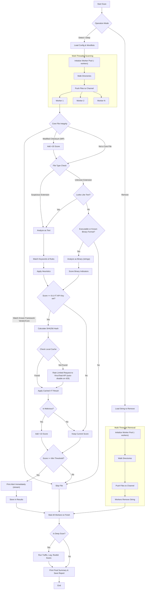

<meta name="description" content="World Shell Finder is a Go-based web shell detection tool with keyword, rule, and heuristic scanning.">
<meta name="keywords" content="webshell finder, web shell detection, golang security tool, malware scanner, incident response">

# World Shell Finder

World Shell Finder is a Go command-line tool for detecting suspicious web shells and backdoors inside web roots or other source directories. It combines keyword matching, regex rules, and heuristic scoring to improve detection quality while reducing noisy single-hit matches.


<p align="center">
  
  <a href="https://github.com/Aryma-f4/worldshellfinder/releases/"></a>
  <a href="https://github.com/Aryma-f4/worldshellfinder/issues"></a>
  <a href="https://github.com/Aryma-f4/worldshellfinder/discussions"></a>
  
</p>


## Disclaimer

This project is intended for educational, incident response, and defensive security use. It does not replace a full malware analysis process. False positives and false negatives are still possible.

## Highlights

- Refactored into a **Clean Architecture** to ensure modularity, maintainability, and scalability.
- Beautiful, intuitive **Interactive UI** powered by `pterm`.
- Integrates **VirusTotal API** as a malware reference database to improve detection rules and confirm suspicious files.
- Lightning fast **multi-threading support** via Goroutines and Worker Pools for massive directory scanning.
- **Dynamic output streaming**, immediately reports potential threats to your terminal without waiting for the scan to finish.
- Detects suspicious **binary backdoors / C2 implants** via networking and malware-behavior indicators.
- Detects suspicious files using a scoring-based engine.
- Combines keyword matches, regex signatures, and heuristic indicators.
- Supports custom wordlists on top of the embedded default wordlist.
- Produces clearer output with suspicion score and evidence summary.
- Includes a string-removal mode for cleanup workflows.
- Ships with GitHub Actions CI/CD and automatic prereleases on each push to the main branch.
- Includes deep scan mode for suspicious traffic and broader rootkit checks.

## Detection Approach

The scanner evaluates files using multiple signals:

- Text-based webshell patterns (keyword + regex rules + heuristic scoring).
- **Language-Specific Wordlists:** Dynamically loads different keyword sets based on the target file extension (e.g. PHP keywords for `.php`, JS/Node keywords for `.js`/`.ts`, Python keywords for `.py`) to completely eliminate cross-language false positives.
- **YARA-like Advanced Heuristics (Pure Go):**
  - **Shannon Entropy Analysis:** Detects highly obfuscated payloads (like hidden Base64 or Hex blobs) by calculating the mathematical information density of contiguous strings.
  - **Memory-Efficient Binary Streaming:** Parses executable and binary-format files for C2/Backdoor indicators without loading massive files into RAM.
- **Smart Extension Filtering:** Automatically ignores static media files, documents, and fonts (e.g. `.jpg`, `.pdf`, `.zip`, `.woff`) to drastically reduce false positives and speed up the scanning process.
- **Core File Integrity Verification:** Automatically detects framework installations and verifies core/vendor files. Unmodified files are safely ignored (Zero False Positives), while modified core files are immediately flagged! Supported frameworks:
  - **WordPress** (Full MD5 checksum validation via official API)
  - **Laravel** (Vendor path validation via `artisan` root detection)
  - **CodeIgniter 4** (System & Vendor path validation via `spark` root detection)
  - **Yii2** (Vendor path validation via `yii` root detection)
- Binary backdoor / C2 indicators (for executable or binary-format files).
  - Hardcoded URLs, IP:PORT, many domain-like strings.
  - Networking-related strings (WinHTTP/WinINet/Winsock, `socket/connect/send/recv`, libcurl, HTTP headers).
  - Malware-like behavior strings (persistence markers, injection markers, packer markers).
- Optional VirusTotal reputation check (only for highly suspicious hits, score >= 8).
  - Uses local in-memory cache.
  - Enforces free-tier rate limit (4 lookups/minute) and auto-disables on HTTP 429.

Files are reported when their suspicion score reaches the configured threshold.

### How It Works (Architecture & Flow)



## Installation

### Build from source

```bash
git clone https://github.com/Aryma-f4/worldshellfinder.git
cd worldshellfinder
go build -o worldshellfinder ./cmd/worldshellfinder
```

### Install with Go

```bash
go install github.com/Aryma-f4/worldshellfinder/cmd/worldshellfinder@latest
```

If your Go binary path is not available in `PATH`, add it first:

```bash
export PATH="$PATH:$HOME/go/bin"
```

## Usage

### Interactive mode

Run the program without flags to use the menu-based interactive mode:

```bash
./worldshellfinder
```

### Detection mode

Basic detection:

```bash
./worldshellfinder -mode detect -dir /var/www/html
```

Detection via list of directories (recursive):

```bash
./worldshellfinder -mode detect -dir-list /tmp/list_of_dirs.txt
```

Verbose detection:

```bash
./worldshellfinder -mode detect -dir /var/www/html -v
```

Detection with a custom wordlist:

```bash
./worldshellfinder -mode detect -dir /var/www/html -wordlist ./wordlists/zeus.txt
```

Detection with a stricter threshold:

```bash
./worldshellfinder -mode detect -dir /var/www/html -min-score 6 -max-evidence 8
```

Save results to a file:

```bash
./worldshellfinder -mode detect -dir /var/www/html -out result.txt
```

### Deep scan mode

Deep scan combines:

- file-based shell detection,
- suspicious traffic inspection,
- threat hunting on common auth, nginx, and apache logs,
- rootkit checks using `rkhunter`, `chkrootkit`, `unhide`, and built-in heuristics.

Example:

```bash
./worldshellfinder -mode deep -dir /var/www/html -out deep-report.txt -v
```

### Remove-string mode

```bash
./worldshellfinder -mode remove -dir /var/www/html -remove-string "malicious_snippet"
```

### Help

```bash
./worldshellfinder -h
```

## CLI Options

```text
-h, --help              Show help information
-v                      Enable verbose output
-mode string            Operation mode: detect, deep, or remove
-dir string             Directory to scan
-out string             Output file path
-wordlist string        Additional custom wordlist file
-min-score int          Minimum score before a file is reported
-max-evidence int       Maximum evidence entries shown per file
-remove-string string   String to remove when mode=remove
-dir-list string        File containing a list of directories to scan (one per line)
-vt-api-key string      VirusTotal API key for checking suspicious files against the malware database
-workers int            Number of concurrent workers for scanning files (default: number of CPUs)
--update                Update to the latest release
```

## Wordlists

The wordlist format allows defining custom weights:

- One keyword or signature per line.
- Use `::` to assign a specific score to a keyword (e.g., `keyword::score`).
- If no score is provided, the keyword defaults to a weight of 4.
- Empty lines and lines starting with `#` are ignored.
- Custom entries are merged with the embedded default wordlist.

Example `custom.txt`:
```text
# Give a high score for a specific backdoor signature
c99shell::6

# Give a low score for system enumeration to avoid false positives
systeminfo::1
whoami::1
```

See:

- [`wordlists/default.txt`](wordlists/default.txt)
- [`wordlists/zeus.txt`](wordlists/zeus.txt)

## Known Coverage

The repository also documents many shell families and samples already covered by the project:

- [Known shell list](list_find_already_shell.md)

## CI/CD

GitHub Actions now provides:

- Test execution on pull requests and pushes.
- Multi-platform build artifacts for Linux, Windows, and macOS.
- Automatic prerelease creation for every push to `main` or `master`.
- Attached archives and checksum file in each generated release.

## Rootkit Detection

Deep scan does not rely on a single tool. It can use:

- `rkhunter`
- `chkrootkit`
- `unhide`
- built-in heuristic checks for preload abuse, suspicious modules, hidden executables, temporary privilege-escalation binaries, and persistence points

## Log Threat Hunting

Deep scan also inspects common log locations such as:

- `/var/log/auth.log`
- `/var/log/secure`
- `/var/log/nginx/access.log`
- `/var/log/apache2/access.log`

It looks for signs such as:

- `cmd=`, `exec=`, `shell=`, or encoded payload probes
- suspicious upload and dropper patterns
- repeated authentication failures and invalid users
- `sudo`, `curl`, `wget`, `nc`, or privilege escalation activity in auth logs

If the process lacks permission to inspect protected paths, the tool prints:

```text
not enough permission to do this, gotta root
```

## Compatibility

- Linux
- Windows
- macOS

[](https://github.com/Aryma-f4/worldshellfinder/actions/workflows/go.yml)

## Contributing

Contributions are welcome. Feel free to open an issue or submit a pull request for:

- new shell signatures,
- detection improvements,
- performance fixes,
- documentation updates.
